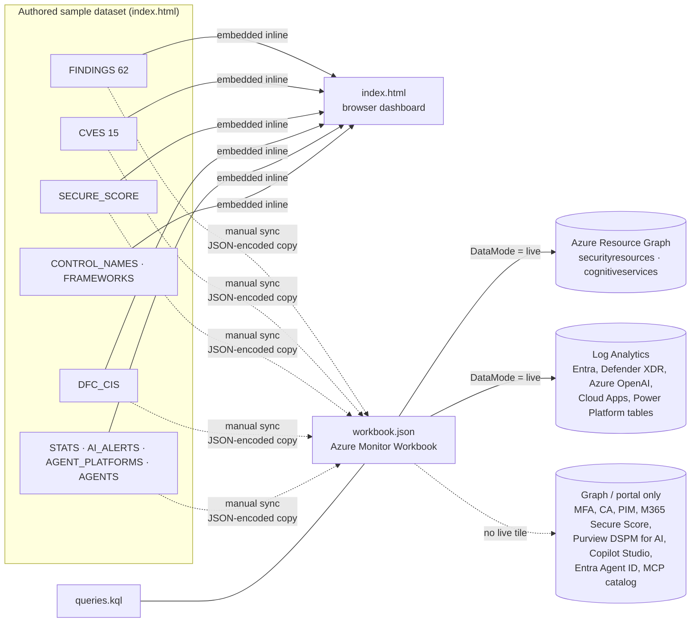
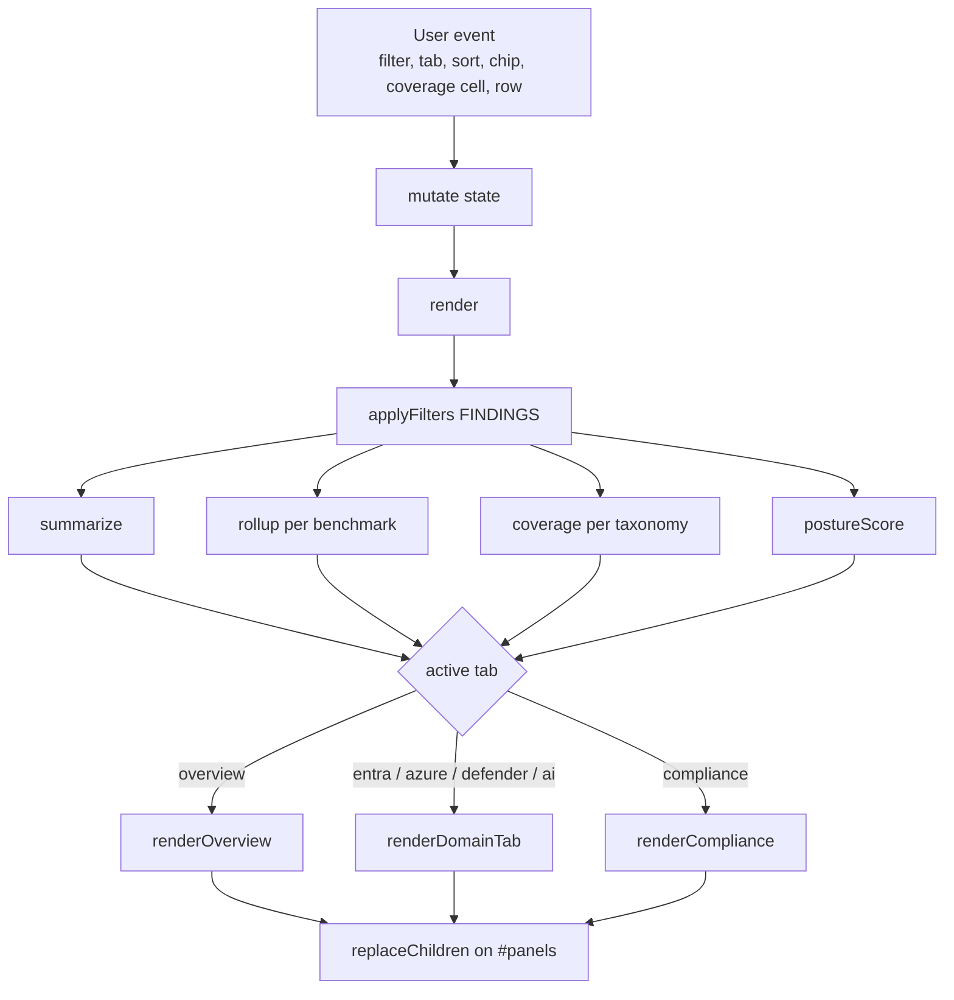
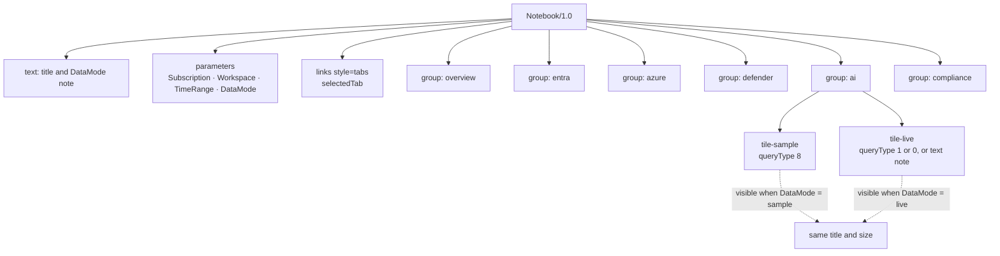
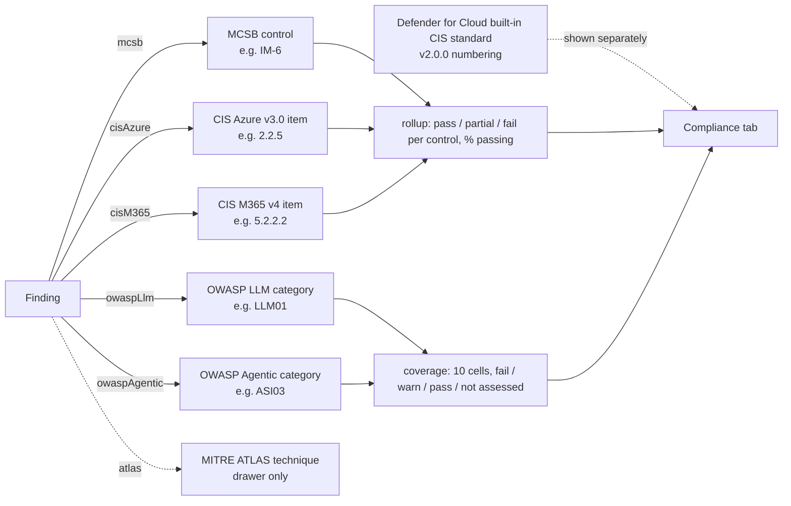

# Architecture

This document explains how the Security Posture Dashboard is put together, why it is built the way it is, and where each piece of data comes from. For the user tour, import steps and permissions see [../README.md](../README.md). For the finding schema and the full control mapping see [DATA-MODEL.md](DATA-MODEL.md).

A rendered overview diagram is in [architecture.svg](architecture.svg) (open it in any browser). The Mermaid diagrams below show the same structure and render on GitHub, Azure DevOps and most Markdown viewers.

## 1. Goals and constraints

| Goal | Consequence |
|---|---|
| Present posture across Entra ID, Azure resources, Defender and AI & Agents in one place | Four domains share one finding schema and one filter row |
| Map each finding to Microsoft best practice, CIS and, for AI, the OWASP threat lists | Every finding carries `mcsb[]`, `cisAzure[]`, `cisM365[]`, `owaspLlm[]`, `owaspAgentic[]`, `atlas[]`; rollups and coverage derive from those arrays |
| Demo without a tenant | All data is sample data, authored once and embedded in both deliverables |
| Match the repo convention | Single HTML file, vanilla JS and CSS, no build step, no external dependencies, works from `file://` |
| Deployable later in Azure | A Workbook template mirrors every tile and carries the real queries next to the sample data |

## 2. System context



The dashboard never talks to anything. The workbook talks to Azure Resource Graph and a Log Analytics workspace only when its `DataMode` parameter is switched to live; in sample mode it needs no data access at all.

## 3. Deliverable 1: `index.html`

### 3.1 Layout of the file

```
<style>   :root theme tokens, layout, marks, tables, coverage strips, drawer, tooltip
<body>    header (hero score) · tabs · filter row · <main id="panels"> · drawer · tooltip
<script>
  DATA      FINDINGS, CVES, SECURE_SCORE, DFC_CIS, STATS, AI_ALERTS, AGENT_PLATFORMS, AGENTS,
            CONTROL_NAMES, FRAMEWORKS (+ derived BENCHMARKS, TAXONOMIES), DOMAINS, TABS
  STATE     state = { tab, filters, sort, cveSort, cveFilters, agentSort, complianceFw, complianceView, drawerId }
  HELPERS   el(), svg(), fmt(), pct(), naturalCompare(), tableFromRows(), showTable()
  DERIVE    applyFilters(), summarize(), findingsScore(), postureScore(), rollup(), coverage()
  CHARTS    renderBarChart(), renderGroupedBars(), renderStackedBars(), renderLegend(), renderStack(),
            renderArc(), renderMeterRow(), renderCoverageStrip()
  TOOLTIP   one element, delegated mousemove/focusin handlers
  RENDER    render() -> renderOverview() | renderDomainTab() | renderCompliance()
            renderFindingsTable(), renderCveCard(), renderAiAlertsCard(), renderOwaspCoverageCard(),
            renderAgentsCard(), controlChips(), aiChips()
  DRAWER    openDrawer(), closeDrawer()
  EVENTS    filter controls, tabs (click + arrow keys), hashchange
  BOOT      read #hash, render()
```

### 3.2 Render cycle



Design points:

- **Single state object, full re-render of the active panel.** There is no diffing. Each render rebuilds the current tab from scratch with `replaceChildren`, which is fast enough for a few hundred rows and keeps the code free of stale-DOM bugs.
- **Filters scope everything.** One filter row sits above all tabs and every chart, tile and table re-renders against the same filtered slice, so numbers always agree. On the four domain tabs the domain select is overridden by the tab's own domain.
- **Data enters the DOM through `textContent` only.** The `el()` helper takes a `text:` attribute and child nodes; there is no `innerHTML` with data. Titles, control IDs and descriptions are treated as untrusted.
- **Deep links.** `setTab` writes `#<tab>` with `history.replaceState`, and boot reads the hash. This is also how the headless verification reaches each tab.
- **Column sets per context.** `renderFindingsTable` picks columns by tab: the AI tab drops the always-empty CIS Azure column and adds a combined "AI frameworks" chip column; the compliance cross-reference shows every mapping column.

### 3.3 Derived values

| Function | Definition |
|---|---|
| `findingsScore` | `100 − weighted open / weighted total`, weights critical 4, high 3, medium 2, low 1; `warn` counts half |
| `postureScore` | Mean of `findingsScore`, Defender for Cloud secure score % and Microsoft Secure Score % |
| `summarize` | Per domain: fail / warn / pass counts, open findings by severity, top open finding |
| `rollup(fw)` | Group findings by control ID for one framework. Control state: fail if any mapped finding fails, else warn if any warn, else pass. Only referenced controls count. Natural sort so `2.10` follows `2.9` and `IM-6` follows `IM-3` |
| `coverage(fw)` | For a taxonomy: one cell per fixed category ID, state from `rollup` when referenced, otherwise "not assessed". Reported as "x of 10 assessed, y with open fails", never as a percentage |

### 3.4 Benchmarks vs taxonomies

`FRAMEWORKS` holds five entries. Three are control benchmarks (MCSB, CIS Azure v3.0, CIS M365 v4) and two are threat taxonomies (OWASP Top 10 for LLM Applications 2025, OWASP Top 10 for Agentic Applications 2025) marked `taxonomy: true` with their 10 fixed category IDs. Both kinds are mapped on findings and filterable through the framework and control filters, but they render differently:

- Benchmarks feed the framework rollup cards and percentages.
- Taxonomies render as 10-cell coverage strips with a "not assessed" state and are excluded from every percentage, because a pass on a mapped control does not mean the risk is absent.

MITRE ATLAS technique IDs are a third kind: they are annotations shown in the detail drawer only and are not a framework.

### 3.5 Charts

All charts are inline SVG built by a handful of helpers, following a small set of rules:

- Marks are thin (bars 10 to 14 px, 2 px gaps), with a hairline baseline and values in text colour.
- Domain colours are categorical and fixed: Entra blue, Azure orange, Defender aqua, AI violet. Filtering never repaints survivors. Violet is used for AI instead of the palette's yellow slot because yellow collides with the warning colour.
- Severity and status colours are reserved and always appear beside a text label, never alone.
- Every chart has a "Show table" twin beneath it, so nothing is readable only by colour or hover.
- One tooltip element serves all marks through delegated `mousemove` and `focusin` handlers; marks also carry `<title>` for native fallback.

### 3.6 Accessibility

Tabs use `role="tablist"` with `aria-selected` and arrow-key navigation. Tables use `<th scope="col">` with `aria-sort`. The filter result count is `aria-live`. The drawer is `role="dialog"` with focus moved in on open and restored to the originating row on close; Escape closes it. Coverage cells are buttons with full labels; unassessed cells are disabled. `prefers-reduced-motion` disables transitions.

## 4. Deliverable 2: `workbook.json`

### 4.1 Structure



- 87 items in total: title text, parameters, tabs and six groups, one per tab, shown by `conditionalVisibility` on the `selectedTab` parameter.
- Inside a group every tile exists twice. The `-sample` item is a `queryType: 8` static JSON data source whose `query` string is itself JSON of the form `{"version":"1.0.0","content":"<JSON-encoded rows>","transformers":null}`. The `-live` item carries the real query: `queryType: 1` against `microsoft.resourcegraph/resources` scoped to `{Subscription}`, or `queryType: 0` against `microsoft.operationalinsights/workspaces` scoped to `{Workspace}` with `TimeRange` as time context.
- Where no live source exists, the `-live` item is a text note explaining why and where to look instead.

### 4.2 Live data sources

| Tiles | Source | Table or resource type |
|---|---|---|
| Recommendations, severity, resource type, Entra/Azure/AI findings tables | Azure Resource Graph | `securityresources` type `microsoft.security/assessments` |
| Secure score and controls | Azure Resource Graph | `microsoft.security/securescores`, `.../securescorecontrols` |
| Defender plan coverage, Defender for AI services plan | Azure Resource Graph | `microsoft.security/pricings` |
| Active alerts, Defender for AI services alerts | Azure Resource Graph | `microsoft.security/locations/alerts` |
| Regulatory compliance (CIS) | Azure Resource Graph | `microsoft.security/regulatorycompliancestandards` and child controls |
| AI resource inventory, model deployments | Azure Resource Graph | `microsoft.cognitiveservices/accounts`, `.../deployments` |
| Legacy auth, MFA split, guest sign-ins | Log Analytics | `SigninLogs` |
| Role assignment changes, app consent | Log Analytics | `AuditLogs` |
| Risky users | Log Analytics | `AADRiskyUsers` |
| Agent identity sign-in activity | Log Analytics | `ServicePrincipalSignInLogs`, `ManagedIdentitySignInLogs` |
| CVEs, exposed devices, missing updates, secure configuration | Log Analytics (Sentinel Defender XDR connector) or Advanced Hunting | `DeviceTvmSoftwareVulnerabilities`, `...KB`, `DeviceTvmSecureConfigurationAssessment` |
| Azure OpenAI usage and content-filter blocks | Log Analytics | `AzureDiagnostics` (RequestResponse, Audit, Trace categories) |
| Copilot interactions | Log Analytics (Defender XDR connector) | `CloudAppEvents` |
| Shadow AI app discovery | Log Analytics (Defender for Cloud Apps connector) | `McasShadowItReporting` |
| Copilot Studio admin activity | Log Analytics | `PowerPlatformAdminActivity` |
| MFA registration, Conditional Access, PIM, consent settings, Microsoft 365 Secure Score, Purview DSPM for AI reports, Copilot Studio agent inventory, Entra Agent ID inventory, Prompt Shields per deployment, MCP catalog, OWASP mapping | Not available in workbooks | Microsoft Graph, admin centers, or authored data; text note in live mode |

`queries.kql` holds every live query verbatim (30 sections) with a header comment naming the workbook item it belongs to. AI-area queries carry notes on what to verify against a real tenant, because table, property and plan names there change often.

## 5. Framework mapping



Three things are deliberately kept apart:

1. **Authored mapping vs reported compliance.** The benchmark cards derive from the mapping arrays on each finding. A separate card shows what Defender for Cloud itself reports for its built-in CIS standard. Defender ships an older CIS version with different numbering, so merging the two would produce wrong control references.
2. **Referenced vs total controls.** Rollup percentages are over controls that at least one finding references. This is stated on screen because it is not full benchmark coverage.
3. **Controls vs threat categories.** OWASP lists are shown as coverage, never as a percentage, and are excluded from the rollup.

Control numbers were transcribed by hand from the benchmark structure. Treat them as best effort until checked against the published PDFs. See DATA-MODEL.md section 7 for the known control-ID collision between CIS Azure and CIS M365 `2.1.1`.

## 6. Keeping the two deliverables in sync

There is no build step, so the dataset is duplicated on purpose:

1. Edit the constants in `index.html`.
2. Regenerate the affected `-sample` tiles in `workbook.json` (findings tables, domain summary, severity counts, framework rollup, cross-reference, AI inventory and agent tiles). The README has a PowerShell snippet that verifies each sample tile still decodes.
3. If a live query changes, update both the `-live` item and `queries.kql`.
4. Regenerate the tables in `docs/DATA-MODEL.md`.

## 7. Verification approach

Node is not installed on the development machine, so verification is done with headless Edge:

```powershell
$edge = "C:\Program Files (x86)\Microsoft\Edge\Application\msedge.exe"
& $edge --headless=new --screenshot=out.png --window-size=1400,2600 "file:///<path>/FableTechDay/index.html#ai"
```

Interactive paths (filters, chip click, drawer, by-control view) were exercised through a small harness page that loads the dashboard in an iframe with `--allow-file-access-from-files` and dispatches the clicks. `workbook.json` is validated by parsing it with `ConvertFrom-Json` and decoding every sample tile. The data tables in DATA-MODEL.md were extracted the same way, by reading the constants through the iframe.

## 8. Decisions and trade-offs

| Decision | Alternative considered | Why this one |
|---|---|---|
| Hand-rolled SVG charts | Chart.js or similar via CDN | Repo convention forbids external dependencies; the charts are simple bars, meters, arcs and strips |
| Full re-render per event | Incremental DOM updates | Dataset is small; simplicity wins and avoids stale state |
| Composite posture score | Findings-only score | An assessment lists mostly failures, so a findings-only score read as broken on a demo; the composite includes the two secure scores and prints all three components |
| OWASP as coverage strips | Treat OWASP like a benchmark with a % | A Top 10 list is a threat taxonomy; a percentage would imply controls that do not exist |
| Violet for the AI domain | Palette slot 4 (yellow) | Yellow is the warning colour; a domain must not look like a status |
| Duplicate data in the workbook | Generate the workbook from the HTML | No build tooling in the repo; the duplication is documented and verifiable |
| Sample and live tiles as pairs | Separate sample and live workbooks | One import, one place to edit titles and layout, instant switch for demos |
| Defender's CIS shown separately | Merge into the rollup | Different benchmark version and numbering |
